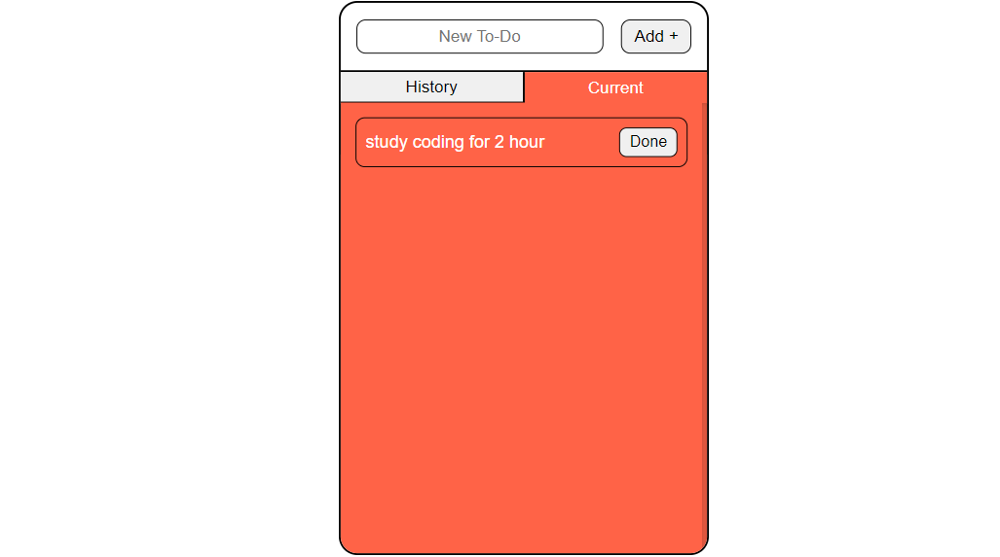

# Todo Website by Samiran 📝✅

🚀 Welcome to the Todo Website project by Samiran! Stay organized and keep track of your tasks with this simple and intuitive todo list website. Manage your todos, mark them as done, and review your history effortlessly.

## Table of Contents

- [Introduction](#introduction)
- [Features](#features)
- [How to Use](#how-to-use)
- [Demo](#demo)
- [Contribution](#contribution)
- [License](#license)

## Introduction

The Todo Website by Samiran is a user-friendly tool designed to help you manage your tasks efficiently. Whether you have a busy schedule or just want to stay organized, this website allows you to add, complete, and review your todos with ease.

## Features

- ✍️ Add new todo items.
- ✅ Mark todos as complete with a single click.
- 📖 View the history of completed todos.
- 🌐 Responsive design for seamless use on various devices.

## How to Use

1. Visit the todo website: [Todo Website by Samiran](https://samiran845.github.io/Todo_Items/).
2. Use the input field to add a new todo item.
3. Click the "Done" button to mark a todo as complete.
4. Navigate to the "History" tab to view your completed todos.
5. Stay organized and keep your tasks in check!

## Demo

Check out the live demo of the Todo Website [here](https://samiran845.github.io/Todo_Items/).

## Contribution

Contributions are welcome! If you have ideas for new features, improvements, or if you find any issues, please open an issue or submit a pull request. Let's make this Todo Website even more powerful and user-friendly together.

## License

Feel free to use and customize the Todo Website to suit your task management needs.

---

Stay organized and focused with the Todo Website by Samiran! 📆🔍